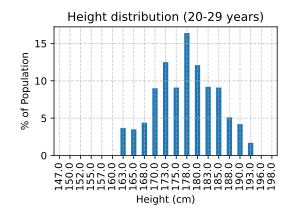
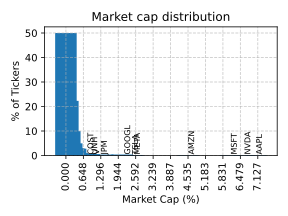
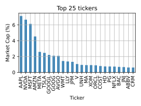
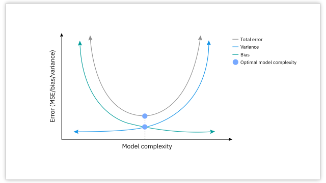

#


# Data Preparation (aka *data pre-processing*)

The **data preparation** phase covers all activities to construct the dataset fed into the modeling tools from the initial data.


It plays a key role in a data analytics process and *avoids "garbage in, garbage out"*

- *A broad range of activities*; from correcting errors to selecting the most relevant features
    - Out-of-range values (e.g., Income: −100)
    - Impossible data combinations (e.g., `Exam mark`: 15, `Exam result`: Passed)
    - Missing values
    - Inconsistent data among multiple sources
- There are *no pre-defined rules* on the impact of pre-processing transformations
- Data scientists *cannot easily foresee the impact of pipeline prototypes*

#

Data pre-processing includes [@shearer2000crisp] data

1. *selection*
1. *cleansing*
1. *construction*
1. *integration*
1. *formatting*

# Select Data

Deciding on the data that will be used for the analysis is based on several criteria, including

- its relevance to the data mining goals
- quality and technical constraints such as GDPR or limits on data volume or data types

Part of the data selection process should involve explaining why certain data was included or excluded.

- It is also a good idea to decide if one or more attributes are more important than others

> For instance, while an individual's address may be used to determine which region that individual is from, the actual street address data can likely be eliminated to reduce the amount of data that must be evaluated.
>
> To learn how sales are characterized by store `type` you do not need to consider the `StoreId`
>
> | ~~`StoreId`~~ | `type` |`sales` |
> |-----------|--------|--------|
> |S1         | grocery   | 1000   |
> |S2         | supermarket | 1500 |
> |S3         | ...  | ...  |

# [What personal data is considered sensitive](https://commission.europa.eu/law/law-topic/data-protection/reform/rules-business-and-organisations/legal-grounds-processing-data/sensitive-data/what-personal-data-considered-sensitive_en)?

The following personal data is considered ‘sensitive’ and is subject to specific processing conditions:

- personal data revealing racial or ethnic origin, political opinions, religious or philosophical beliefs;
- trade-union membership;
- genetic data, biometric data processed solely to identify a human being;
- health-related data;
- data concerning a person’s sex life or sexual orientation.

See [article 4](https://eur-lex.europa.eu/legal-content/EN/TXT/HTML/?uri=CELEX:32016R0679&from=EN#d1e1489-1-1)

# Clean Data (or data cleansing)

*Without clean data, the results of a data mining analysis are in question*.

The data analyst must

- select clean subsets of data or incorporate techniques such as estimating missing data through modeling analyses
- make sure they outline how they addressed each quality problem reported in the earlier "Verify Data Quality" step

# Imputation of missing values

**Imputation** is the process of replacing missing data with substituted values.

*Listwise deletion* (complete case) deletes data with missing values

- If data are missing at random, listwise deletion does not add any bias, but it decreases the sample size
- Otherwise, listwise deletion will introduce bias because the remaining data are not representative of the original sample

:::: {.columns}
::: {.column width="49%"}

> Before cleaning
>
> | `StoreId` | `type` |`sales` |
> |-----------|--------|--------|
> |S1         |    | 1000   |
> |S2         | supermarket |  |
> |S3         | grocery  | 100  |

:::
::: {.column width="49%"}

> After cleaning
>
> | `StoreId` | `type` |`sales` |
> |-----------|--------|--------|
> |S3         | grocery  | 100  |

:::
::::

*Pairwise deletion* deletes data when it is missing a variable required for a particular analysis

- ... but includes that data in analyses for which all required variables are present

# Imputation of missing values

*Hot-deck imputation*: the information donors come from the same dataset as the recipients

- One form of hot-deck imputation is called "last observation carried forward"
    - Sort a dataset according to any number of variables, thus creating an ordered dataset
    - Finds a missing value and uses the value immediately before the data that are missing to impute the missing value

:::: {.columns}
::: {.column width="49%"}

> Before cleaning
>
> | `StoreId` | `Date` |`sales` |
> |-----------|--------|--------|
> |S1         | 2024-10-04 | 1000   |
> |S1         | 2024-10-05 |  |
> |S2         | 2024-10-04 |  |

:::
::: {.column width="49%"}

> After cleaning (sort by `StoreId` and `Date`)
>
> | `StoreId` | `Date` |`sales` |
> |-----------|--------|--------|
> |S1         | 2024-10-04 | 1000   |
> |S1         | 2024-10-05 | *1000* |
> |**S2**         | 2024-10-04 | *1000* |

:::
::::

*Cold-deck imputation* replaces missing values with values from similar data in different datasets

# Imputation of missing values

*Mean substitution* replaces missing values with the mean of that variable for all other cases

- Mean imputation attenuates any correlations involving the variable(s) that are imputed
    - There is no relationship between the imputed variable and any other measured variables.
    - Mean imputation can be carried out within classes (i.e. categories, such as gender)

:::: {.columns}
::: {.column width="49%"}

> Before cleaning
>
> | `StoreId` | `Date` |`sales` |
> |-----------|--------|--------|
> |S1         | 2024-10-04 | 1000   |
> |S1         | 2024-10-05 |  |
> |S1         | 2024-10-06 | 2000 |
> |S2         | 2024-10-04 |  |
> |S2         | 2024-10-05 | 1000 |

:::
::: {.column width="49%"}

> After cleaning (average by `StoreId`)
>
> | `StoreId` | `Date` |`sales` |
> |-----------|--------|--------|
> |S1         | 2024-10-04 | 1000   |
> |S1         | 2024-10-05 | *1500* |
> |S1         | 2024-10-06 | 2000 |
> |S2         | 2024-10-04 | *1000* |
> |S2         | 2024-10-05 | 1000 |

:::
::::

# Which mean? Compount interest

Consider an investment portfolio with initial value 1000€ and final value 2406.62€ after 18 years.

Which return has the portfolio generated each year?

# Which mean? Compount interest

:::: {.columns}
::: {.column width="70%"}

> Our portfolio has an initial value $V_0 = 1000€$ and each has a return of X%
>
> The first year, the portfolio increases its value to $V_1=1000€ + (1000€ \times X\%) = 1050€$
>
> The second year, the portfolio increases its value to $V_2 = V_1 + (V_1 \times X\%) = 1102.50€$
>
> ... and so on.

:::
::: {.column width="29%"}

> |Year| Value |
> |----|-----------|
> |0   |1000.00 € |
> |1   |1050.00 € |
> |2   |1102.50 € |
> |... |...        |
> |18  |2406.62 € |

:::
::::

This is not a linear increase but a geometric sequence, the final value is $\text{Initial value} \times (1 + \frac{r}{n})^\frac{t}{n}$

- $r$ is the nominal annual interest rate
- $n$ is the compounding frequency (1: annually, 12: monthly, 52: weekly, 365: daily)
- $t$ is the overall length of time the interest is applied (expressed using the same time units as n, usually years).

> $\text{Final value} = \text{Initial value} \times (1 + X)^{18}$
>
> $X = (\frac{\text{Final value}}{\text{Initial value}})^\frac{1}{18} - 1$
>
> $X = 0.05 = 5\%$

In this case the return is equal every year, so the average interest is $5\%$.

# Which mean? Compount interest

Let us assume now that the returns changes over year.

> |Year| Value | Return|
> |----|-----------|---|
> |0|1000.00 €| 	-|
> |1|1050.00 € |	5%|
> |2|997.50 € 	|-5%|
> |3|1047.38 € |	5%|
> |4|995.01 € 	|-5%|
> |5|995.01 € |	0%|

What is the average return?

# Which mean? Compount interest

:::: {.columns}
::: {.column width="50%"}

If we apply the aritmetic mean it is $\frac{5 -5 + 5 -5 + 0}{5} = 0%$

However, **this is wrong!**

:::
::: {.column width="50%"}

> |Year| Value | Return|
> |----|-----------|---|
> |0|1000.00 €| -|
> |1|1000.00 €| 0%|
> |2|1000.00 €| 0%|
> |...|...|...|
> |5|1000.00 €| 0%|

:::
::::

:::: {.columns}
::: {.column width="50%"}

We already know that $X = \frac{\text{Final value}}{\text{Initial value}}^\frac{1}{5} - 1$

The average return is $X = -0.1\%$

$X\%$ is the *Compound Annual Growth Rate*, the mean annualized growth rate for compounding values over a given time period.

- CAGR smoothes the effect of volatility of periodic values that can render arithmetic means less meaningful.

:::
::: {.column width="50%"}

> |Year| Value | Return|
> |----|-----------|---|
> |0|1000.00 €|	-|
> |1|999.00 € |	-0.1%|
> |2|998.00 € |	-0.1%|
> |...|...|...|
> |5|995.01 € |	-0.1%|

:::
::::

**Take away**: pay attention to the semantics of the features!

# Skewed distributions


What problems can arise with skewed distributions?

#


# Skewed distributions

What happens to mean and median values?

:::: {.columns}
::: {.column width="50%"}



:::
::: {.column width="50%"}



:::
::::

# Skewed distributions

:::: {.columns}
::: {.column width="50%"}


```
Mean   = 173 cm
Median = 173 cm
```

:::
::: {.column width="50%"}


```
Mean:   103158262914
Median:  36666524821
```

:::
::::

# Skewed distributions: Stocks

The [Standard and Poor's 500](https://en.wikipedia.org/wiki/S%26P_500) index tracks the stock performance of [500 of the largest companies](https://en.wikipedia.org/wiki/List_of_S%26P_500_companies) in the United States.



- Companies emit stocks that are buyed by investors, the number of stocks is called *shares outstanding*
    - *Shares outstanding* are shares of a corporation that have been purchased by investors and are held by them
- Stocks are daily traded in stock market
    - *Volume* is the amount of shares that are daily traded
    - *Close* and *Open* are closing/opening prices of daily trades

How would you define the *weight* of a company in the index?

# Skewed distributions: Stocks

As a semplification, given a company $C$ and a generic index $I$

:::: {.columns}
::: {.column width="49%"}

*Market cap weight* (e.g., [S&P 500](https://en.wikipedia.org/wiki/S%26P_500))

- $\text{MarketCap(C)} = \text{SharesOut(C)} \times \text{StockPrice(C)}$
- $\text{MarketCapWeight(C)} = \frac{\text{MarketCap(C)}}{\sum_{C' \in I} \text{MarketCap(C')}}$

*Price weight index* (e.g., [Dow Jones Industrial Average](https://en.wikipedia.org/wiki/Dow_Jones_Industrial_Average))

- $\text{PriceWeight(C)} = \frac{\text{StockPrice(C)}}{\sum_{C' \in I} \text{StockPrice(C')}}$

:::
::: {.column width="50%"}

> Given a few companies such as
>
> | Ticker   |   Close |      Shares |   PWI (%) |   Market Cap (%) |
> |:---------|--------:|------------:|----------:|-----------------:|
> | AMZN     |  222.13 | 1.0515e+10  |  3.20253  |         4.53745  |
> | AAPL     |  242.7  | 1.51158e+10 |  3.4991   |         7.12683  |
> | GS       |  580.02 | 3.1391e+08  |  8.36237  |         0.353707 |
> | MSFT     |  424.56 | 7.43488e+09 |  6.12105  |         6.13209  |
> | NVDA     |  140.11 | 2.449e+10   |  2.02002  |         6.66582  |
>
> What is their impact on DJIA and S&P?

:::
::::

# Skewed distributions: Stocks


# Outlier removal

**Outlier removal** is the process of eliminating data points that deviate significantly from the rest of the dataset

- An *outlier* is a data point that differs significantly from other observations
- Outliers can occur by chance or measurement error, or that the population has a heavy-tailed distribution

:::: {.columns}
::: {.column width="49%"}


:::
::: {.column width="25%"}


:::
::::

In the case of normally distributed data, the *three sigma rule* means that:

- Nearly all values (99.7%) lie within three standard deviations of the mean
    - Roughly 1 in 22 observations will differ by twice the standard deviation or more from the mean,
    - ... and 1 in 370 will deviate by three times the standard deviation.
- If the sample size is only 100, however, just three such outliers are already reason for concern.

# Outlier removal

:::: {.columns}
::: {.column width="60%"}

Other methods flag outliers based on measures such as interquartile range.

For example, if $Q_{1}$ and $Q_{3}$ are the lower and upper quartiles respectively, then one could define an outlier to be any observation outside the range:

- $[Q_{1}-k(Q_{3}-Q_{1}),Q_{3}+k(Q_{3}-Q_{1})]$ for some nonnegative $k$
- John Tukey proposed $k=1.5$ to indicate an "outlier" $k=3$ to indicate data that is "far out"

:::
::: {.column width="40%"}


:::
::::

# Outlier removal

**Isolation Forest** [@liu2008isolation] is an algorithm for data anomaly detection using binary trees

- Because anomalies are few and different from other data, they can be isolated using few partitions.
- Unlike decision tree algorithms, it uses only path length to output an anomaly score, and does not use leaf node statistics of class distribution or target value.

:::: {.columns}
::: {.column width="49%"}


:::
::: {.column width="49%"}


:::
::::

# The black swan theory

Juvenal (55-128, Roman poet) wrote in his Satire VI of *events being "a bird as rare upon the earth as a black swan"*

- When the phrase was coined, the black swan was presumed by Romans not to exist.
- All swans are white because all records reported that swans had white feathers.

:::: {.columns}
::: {.column width="70%"}

In 1697, Dutch explorers became the first Europeans to see black swans in Australia.

- Observing a *single black swan* is the undoing of the logic of any system of thought
    - ... as well as any reasoning that followed from that underlying logic.
- Conclusions are potentially undone once any of its fundamental postulates is disproved.

:::
::: {.column width="30%"}

](https://upload.wikimedia.org/wikipedia/commons/thumb/2/2b/Black_swan_jan09.jpg/1280px-Black_swan_jan09.jpg)

:::
::::

The black swan theory was developed by Nassim Nicholas Taleb [@taleb2008impact] to explain:

- The disproportionate role of hard-to-predict and rare events that are beyond the realm of normal expectations.
- The non-computability of the probability of consequential rare events using scientific methods.
- The psychological biases that blind people to uncertainty and to the substantial role of rare events in historical affairs.

Such extreme events (outliers), collectively play vastly larger roles than regular occurrences.

# The black swan theory in action!

[Long-Term Capital Management](https://en.wikipedia.org/wiki/Long-Term_Capital_Management) was a *highly leveraged* hedge fund.

- Members of LTCM's board of directors included Myron Scholes and Robert C. Merton, who three years later in 1997 shared the Nobel Prize in Economics
- LTCM was initially successful, with annualized returns of around
    - 21% in its first year,
    - 43% in its second year,
    - and 41% in its third year.
- However, in 1998 it lost $4.6 billion *in less than four months due to an unlikely combination* of high leverage and exposure to the 1997 Asian financial crisis and 1998 Russian financial crisis.

:::: {.columns}
::: {.column width="60%"}

> [@jorion2000risk] Even worse, on 21 August, the portfolio lost $550 million. By 31 August, the portfolio had lost $1,710 million in 1 month only. Using the presumed $45 million daily (or $206 million monthly) standard deviation, this translates into a *8.3 standard deviation event*. Assuming a normal distribution, *such an event would occur once every 800 trillion years, or 40,000 times the age of the universe*. Surely this assumption was wrong.

:::
::: {.column width="40%"}


:::
::::

# Construct data

The data analyst could undertake operations such as developing entirely new records or producing derived attributes.

- *Derived attributes should only be added if they ease the modeling algorithm*
    - ... and not just to reduce the number of input attributes

> A derived attribute is `area` = `length` x `width`.
>
> A derived attribute is `income_per_head` which could be easier to use than `income_per_household`.

*Binning* may be necessary to *transform ranges to symbolic fields* (e.g., ages to age bands)

:::: {.columns}
::: {.column width="49%"}

> Before binning
>
> | `StoreId` | `Date` |`sales` |
> |-----------|--------|--------|
> |S1         | 2024-10-04 | 1000 |
> |S1         | 2024-10-05 | 1500 |
> |S1         | 2024-10-06 | 2000 |

:::
::: {.column width="49%"}

> After binning (every 1000€)
>
> | `StoreId` | `Date`     |`sales` |`sales_bin` |
> |-----------|--------    |--------|--------|
> |S1         | 2024-10-04 | 1000 | \[1000-2000\) |
> |S1         | 2024-10-05 | 1500 | \[1000-2000\) |
> |S1         | 2024-10-06 | 2000 | \[2000-3000\) |

:::
::::

*Encoding* may be necessary to transform *or symbolic fields ("definitely yes", "yes", "don't know", "no") to numeric values*

# Feature encoding

**Encoding** is the process of converting categorical variables into numeric features.

- Most machine learning algorithms, like linear regression and support vector machines, require input data to be numeric because they use numerical computations to learn the model.
- These algorithms are not inherently capable of interpreting categorical data.
- Some implementations of decision tree-based algorithms can directly handle categorical data.

Categorical features can be *nominal* or *ordinal*.

- *Nominal features* (e.g., colors) do not have a defined ranking or inherent order.
- *Ordinal features* (e.g., size) have an inherent order or ranking

*One hot encoding* and *ordinal encoding* are the most common methods to transform categorical variables into numerical features.

# Feature encoding: ordinal encoding

**Ordinal encoding** replaces each category with an integer value.

- These numbers are, in general, assigned arbitrarily.
- Ordinal encoding is a preferred option when the categorical variable has an inherent order.

> Examples include the variable `size`, with values "small", "medium", and "large".
>
> :::: {.columns}
> ::: {.column width="49%"}
>
> Before encoding
>
> | `ProductId` | `size` |
> |-------------|--------|
> |P1           | small  |
> |P2           | medium |
> |P3           | large  |
> |P4           | small  |
>
> :::
> ::: {.column width="49%"}
>
> After encoding (small = 0, medium = 1, large = 2)
>
> | `ProductId` | `size` | `size_enc` |
> |-------------|--------|--------|
> |P1           | small  | 0  |
> |P2           | medium | 1  |
> |P3           | large  | 2  |
> |P4           | small  | 0  |
>
> :::
> ::::

# The Likert scale

The Likert scale is widely used in social work research, and is commonly constructed with four to seven points.

- `[*, **, ***, ****, *****]`
- `[1, 2, 3, 4, 5]`

What about averaging?

# The Likert scale

It is usually treated as an interval scale, but strictly speaking it is an ordinal scale, where arithmetic operations cannot be conducted [@wu2017can]

    Converting responses to a Likert-type question into an average seems an obvious and intuitive step, but it doesn't necessarily constitute good methodology. One important point is that respondents are often reluctant to express a strong opinion and may distort the results by gravitating to the neutral midpoint response. It also assumes that the emotional distance between mild agreement or disagreement and strong agreement or disagreement is the same, which isn't necessarily the case. At its most fundamental level, the problem is that the numbers in a Likert scale are not numbers as such, but a means of ranking responses.

# J-shaped distribution


People tend to write reviews only when they are either extremely satisfied or extremely unsatisfied.

People who feel the product is average might not be bothered to write a review

[@hu2009overcoming]

# Feature encoding: one-hot encoding

**One-hot encoding (OHE)** replaces categorical variables by *a set of binary variables* (each representing a category in the variable)

- The binary variable takes the value 1 if the observation shows the category, or alternatively, 0.
- One hot encoding treats each category independently.

> Examples include the variable `color`, with values "red", "green", and "blue".
>
> :::: {.columns}
> ::: {.column width="49%"}
>
> Before encoding
>
> | `ProductId` | `color` |
> |-------------|--------|
> |P1           | red  |
> |P2           | green |
> |P3           | blue  |
> |P4           | red  |
>
> :::
> ::: {.column width="49%"}
>
> After encoding
>
> | `ProductId` | `color` | `red` | `green` | `blue` |
> |-------------|--------|--------|--------|--------|
> |P1           | red   | 1  | 0  | 0  |
> |P2           | green | 0  | 1  | 0  |
> |P3           | blue  | 0  | 0  | 1  |
> |P4           | red   | 1  | 0  | 0  |
>
> :::
> ::::

OHE increases the dimensionality of the dataset and it may not be suitable for encoding high cardinality features.

- To prevent a massive increase of the feature space, we can one-hot encode only the most frequent categories in the variable.
- ... less frequent values are treated collectively and represented as 0s in all the binary variables.

## Encoding data with the wrong type


## Encoding data with the wrong type

Encoding the date 2022-01-01T00:01 into a signed integer $2201010001$

A signed integer is a 32-bit datum that represents an integer in the range:

- Valid range: $[-2^{31}, 2^{31}-1] = [-2147483648, 2147483647]$
- However, $2201010001 > 2147483647$

See also the [year 2000 problem](https://en.wikipedia.org/wiki/Year_2000_problem)


# Feature scaling (or data normalization)

**Feature scaling** is a method used to normalize the range of independent variables or features of data

- Since the range of values of raw data varies widely, in some machine learning algorithms objective functions will not work properly without normalization.
- If one of the features has a broad range of values, the distance will be governed by this particular feature.
- For example, many classifiers calculate the distance between two points by the Euclidean distance.
    - $d(p,q)={\sqrt {(p_{1}-q_{1})^{2}+(p_{2}-q_{2})^{2}+\cdots +(p_{n}-q_{n})^{2}}} = \sqrt{\sum_{i=1}^n (p_i - q_i)^2}$


> Consider a dataset with two features `age` $\in [0, 120]$ and `income` $\in [0, 100000]$
>
> :::: {.columns}
> ::: {.column width=60%}
>
> Given four points
>
> - $p_1=($`age` = 50, `income` = 10000$)$
> - $p_2=($`age` = 50, `income` = 20000$)$, $d(p_1,p_2)=10000.00$
> - $p_3=($`age` = 60, `income` = 10000$)$, $d(p_1,p_3)=10.00$
> - $p_4=($`age` = 60, `income` = 20000$)$, $d(p_1,p_4)=10000.00$
>
> :::
> ::: {.column width=40%}
>
> 
>
> :::
> ::::

# Feature scaling

*Min-max normalization* rescales the features in $[a, b]$ (tipically $[0, 1]$): $x'=a+{\frac{(x-{\text{min}}(x))(b-a)}{{\text{max}}(x)-{\text{min}}(x)}}$

*Standardization* makes the values of each feature in the data have zero-mean and unit-variance: $x'={\frac{x-{\bar {x}}}{\sigma}}$

*Robust scaling* is designed to be robust to outliers: $x'={\frac{x-Q_{2}(x)}{Q_{3}(x)-Q_{1}(x)}}$

> :::: {.columns}
> ::: {.column width=50%}
>
> 
>
> :::
> ::: {.column width=50%}
>
> 
>
> :::
> ::::

#

Original Iris dataset

:::: {.columns}
::: {.column width=24%}

.svg)

:::
::: {.column width=24%}

.svg)

:::
::: {.column width=24%}

.svg)

:::
::: {.column width=24%}

.svg)

:::
::::

Transformed Iris dataset: `petal_length*=10`, addition of 1 outlier [`petal_length`=100, `petal_width`=100]

:::: {.columns}
::: {.column width=24%}

.svg)

:::
::: {.column width=24%}

.svg)

:::
::: {.column width=24%}

.svg)

:::
::: {.column width=24%}

.svg)

:::
::::

# Aggregation

**Aggregation** computes new values by summarizing information from multiple records and/or tables.

> For example, converting a table of product purchases, where there is one record for each purchase, into a new table where there is one record for each store.

:::: {.columns}
::: {.column width="49%"}

> Before aggregation (detailed data)
>
> | `StoreId` | `ProductId` |`sales` |
> |-----------|-------------|--------|
> |S1         | P1 | 750   |
> |S2         | P1 | 250 |
> |S3         | P2 | ...  |

:::
::: {.column width="49%"}

> After aggregation (sum sales by store)
>
> | `StoreId` |`sales` |
> |-----------|--------|
> |S1         | 1000   |
> |S2         | 1500 |
> |S3         | ...  |

:::
::::

Pay attention to the *aggregation operator*!

- Correct: sum of sums
    - $(1 + 2) + (3 + 4 + 5) = 1 + 2 + 3 + 4 + 5 = 15$
- Wrong: average of averages
    - $avg(avg(1, 2), avg(3, 4, 5)) = avg(1.5, 4) = 2.75$
    - $avg(1, 2, 3, 4, 5) = 3$

# Binning

**Data binning** is a data pre-processing technique that reduces the effects of minor observation errors

- The original values which fall into a given interval (bin) are replaced by a central value representative of that interval
- Histograms are an example of data binning used in order to observe underlying frequency distributions

*Equal-width*: divide the range of values into equal-sized intervals or bins

- For example, if the values range from 0 to 100, and we want 10 bins, each bin will have a width of 10
- It can create empty or sparse bins, especially if the data is skewed or has outliers

*Equal-frequency*: divide the values into bins that have the same number of observations or frequency

- For example, if we have 100 observations and we want 10 bins, each bin will have 10 observations
- It creates balanced bins that can handle skewed data and outliers better
- The disadvantage is that it can distort the distribution of the data and create irregular bin widths

#


#


# Integrate Data

**Integration** involves *combining information from multiple tables* or records to create new records or values.

- With table-based data, an analyst can join two or more tables that have different information about the same objects.

> For instance, a retail chain has one table with information about each store's general characteristics (e.g., floor space, type of mall), another table with summarized sales data (e.g., profit, percent change in sales from the previous year), and another table with information about the demographics of the surrounding area.
>
> These tables can be merged together into a new table with one record for each store.


:::: {.columns}

::: {.column width="30%"}

> | `StoreId` | `type` |
> |-----------|--------|
> |S1         | grocery   |
> |S2         | supermarket |
> |S3         | ...  |

:::
::: {.column width="3%"}

\+

:::
::: {.column width="30%"}

> | `StoreId` |`sales` |
> |-----------|--------|
> |S1         | 1000   |
> |S2         | 1500 |
> |S3         | ...  |

:::
::: {.column width="3%"}

=

:::
::: {.column width="30%"}

> | `StoreId` | `type` |`sales` |
> |-----------|--------|--------|
> |S1         | grocery   | 1000   |
> |S2         | supermarket | 1500 |
> |S3         | ...  | ...  |

:::
::::


# Data integration

**Data integration** combines data residing in different sources and provides users with a unified view of them.

*Primary key-based integration* combines multiple sources based on matching unique identifiers (primary keys).

- This method works when both datasets have a well-defined and consistent schema with common key fields.

*Semantic integration* focuses on understanding the meaning of the data from different sources to combine it effectively.

- The goal is to merge data that may use different names, terminologies, or structures to describe the same concepts.
- Data is integrated based on semantic meaning rather than structural similarities.
- It involves the use of ontologies or data dictionaries to map similar concepts across datasets, ensuring consistency.
- It requires understanding the context, meaning, and relationships within the data.
    - For instance, spatial data can be easily integrated into maps

# Semantic Integration vs Primary Key-based Integration

| **Aspect**   | **Semantic Integration**                                  | **Primary Key-based Integration**                      |
|--------------|-----------------------------------------------------------|-------------------------------------------------------|
| *Approach*   | Based on meaning and understanding of the data.           | Based on matching unique keys.     |
| *Suitability*| Data with heterogeneous terminologies or structures. | Datasets have common, well-defined keys.    |
| *Complexity* | Complex to interpret and align meanings. | Simpler, relies on exact key matches.                 |
| *Flexibility*| Integrate data with different schemas/representations. | Less flexible, requires shared primary key fields.     |
| *Challenges* | Requires mapping of concepts and domain semantics. | Limited to datasets that share a key. |

# Format Data

In some cases, the data analyst will *change the format of the data*.

- Sometimes these changes are needed to make the data suitable for a specific modeling tool.
- In other instances, the changes are needed to pose the necessary data mining questions.


Examples:

- Simple: removing illegal characters from strings or trimming them to a maximum length
- More complex: reorganization of the information (e.g., *from normalized to flat tables*)

# Dimensionality reduction

**Dimensionality reduction** is the transformation of data from a high-dimensional space into a low-dimensional space

- Working in high-dimensional spaces can be undesirable for many reasons
- Raw data are often sparse as a consequence of the curse of dimensionality
- Dimensionality reduction can be used for noise reduction, data visualization, cluster analysis, or as an intermediate step to facilitate other analyses

The main approaches can also be divided into *feature selection* and *feature extraction*.

# Feature engineering

Feature engineering, in data science, refers to manipulation — addition, deletion, combination, mutation — of your data set to improve machine learning model training, leading to better performance and greater accuracy.

# Feature selection

**Feature selection** is the process of selecting a subset of relevant features (variables, predictors) for use in model construction

:::: {.columns}
::: {.column width="60%"}

Simplest algorithm is to test each possible subset of features finding the one which minimizes the error rate

- This is an exhaustive search of the space, and is computationally intractable for all but the smallest of feature sets

If $S$ is a finite set of features with the cardinality $|S| = n$, then the number of all the subsets of $S$ is $|P(S)| = 2^n - 1$ (we do not consider the empty set)

- With three features: $2^3=8$
- With four features: $2^4=16$
- With ten features: $2^{10}=1024$

:::
::: {.column width="40%"}


:::
::::

Feature selection approaches are characterized by

- *Search technique* for proposing new feature subsets
- *Evaluation measure* which scores the different feature subsets

# Feature selection

:::: {.columns}
::: {.column width="65%"}

**Feature selection** approaches try to find a subset of the input variables

*Filter* strategy: select variables regardless of the model

- Based only on general features like the correlation with the variable to predict

*Wrapper* strategy

- Methods include forward selection, backward elimination, and exhaustive search

*Embedded* strategy

- Add/remove features while building the model based on prediction errors
- A learning algorithm takes advantage of its own variable selection process and performs feature selection and classification simultaneously

:::
::: {.column width="34%"}


:::
::::

# Feature selection: Filter strategy

*Variance threshold*

- Mean: $\mu = \frac{1}{n} \sum _{i=1}^{n}x_{i}$, Variance: $Var(X)={\frac{1}{n}}\sum _{i=1}^{n}(x_{i}-\mu)^{2}$
- Features with low variance do not contribute much information to a model.
- Use a variance threshold to remove any features that have little to no variation in their values.
- Since variance can only be calculated on numeric values, this method only works on quantitative features.

:::: {.columns}
::: {.column width="33%"}

> Before selection
>
> | `StoreId` |`sales` |`PostalCode` |
> |-----------|--------|--------|
> | 1         | 1000   | 47522 |
> | 2         | 1500 | 47522 |
> | 3         | 1000  |  47522 |
:::
::: {.column width="33%"}

> Compute variance
>
> $VAR($`StoreId`$)=0.67$ **(?)**
>
> $VAR($`sales`$)=55555.56$
>
> $VAR($`PostalCode`$)=0$

:::
::: {.column width="33%"}

> After selection ($VAR(X) > 0.6$)
>
> | `StoreId` |`sales` |
> |-----------|--------|
> | 1         | 1000   |
> | 2         | 1500   |
> | 3         | 1000   |

:::
::::

# Feature selection: Filter strategy

:::: {.columns}
::: {.column width="60%"}

*Pearson's correlation*: measures the linear relationship between two numeric variables

- A coefficient close to 1 represents a positive correlation, -1 a negative correlation, and 0 no correlation
- *Correlation between features*:
    - When two features are highly correlated with one another, then keeping just one to be used in the model will be enough
    - The second variable would only be redundant and serve to contribute unnecessary noise.
- *Correlation between feature and target*:
    - If a feature is not very correlated with the target variable, such as having a coefficient of between -0.3 and 0.3, then it may not be very predictive and can potentially be filtered out.

:::
::: {.column width="40%"}


:::
::::

# Feature selection: Wrapper strategy

Each new feature subset is used to train a model, which is tested on a hold-out set

- Counting the number of mistakes made on that hold-out set (the error rate of the model) gives the score for that subset
- As wrapper methods train a new model for each subset, they are very computationally intensive but provide good results
- *Stepwise regression* adds the best feature (or deletes the worst feature) at each round

*Backward elimination*

We start with the full model (including all the independent variables) and then incrementally remove the most insignificant feature.

This process repeats again and again until we have the final set of significant features.

1. Choose a significance level (e.g., SL = 0.05 with a 95% confidence).
1. Fit a full model including all the features.
1. Consider the feature with the highest p-value.
    - If the p-value < terminate the process.
1. Remove the feature which is under consideration.
1. Fit a model without this feature. Repeat the entire process from Step 3.

# Feature selection: Embedded strategy

:::: {.columns}
::: {.column width="65%"}

Linear regression model: $\hat{y}_i = \beta_1 x_1 + \beta_2 x_2 + ... + \beta_p x_p$

- Goal is minimizing the sum of squared errors between predicted/actual values
- $min(\sum_{i=1}^n​(y_i​ - \hat{y}_i​)^2)$
    - $y_i$​ (red) is the actual value, $\hat{y}_i$​ is the predicted value (blue)

*Least Absolute Shrinkage and Selection Operator (LASSO)*

- Lasso adds a penalty proportional to the absolute values of the coefficients.
- $min(\sum_{i=1}^n​(y_i​ - \hat{y}_i​)^2+ \lambda \sum_{j=1}^p​ ∣\beta_j​∣)$
    - $\beta_j$​ are the coefficients of the model,
    - $\lambda$ is the regularization parameter controlling the penalty's strength.

Lasso performs automatic feature selection.

- By shrinking some coefficients to 0, Lasso removes irrelevant features

The optimal $\lambda$ can be determined with cross-validation techniques.

See also [@katrutsa2017comprehensive] [@chan2022mitigating]

:::
::: {.column width="34%"}




:::
::::

# Feature extraction (or feature projection)

**Feature projection** transforms the data from the high-dimensional space to a space of fewer dimensions

- The data transformation may be linear, as in principal component analysis (PCA)
- ... but many nonlinear dimensionality reduction techniques also exist

*Principal component analysis (PCA)* is a linear dimensionality reduction technique.

- PCA aims to preserve as much of the data's variance as possible in fewer dimensions
- Variance measures of how much the data points differ from the mean of the dataset
- The data is linearly transformed onto a new coordinate system such that the directions (*principal components*) capturing the largest variation in the data can be easily identified
- The first principal component captures the highest variance, the second component captures the second highest, and so on.

Computing PCA

- PCA is sensitive to the scale of the data, the first step is usually to standardize the features (mean = 0, standard deviation = 1) to ensure that all features contribute equally to the analysis.
- Then, compute the covariance Matrix
    - Eigenvectors represent the directions of the principal components.
    - Eigenvalues represent the magnitude of variance in the direction of the corresponding eigenvector.
- The eigenvector with the largest eigenvalue is the first principal component, and so on.

# PCA on the Iris dataset

:::: {.columns}
::: {.column width="60%"}

Iris contains 4 features, we cannot plot it directly

1. `petal_length`
1. `petal_width`
1. `sepal_length`
1. `sepal_width`


:::
::: {.column width="40%"}

| Principal Component | Explained Variance |
|---------------------|--------------------|
| PC 1                | 92.46%             |
| PC 2                | 5.31%              |
| PC 3                | 1.71%              |

Feature Relevance for 3 Components:

| Feature           | PC 1  | PC 2  | PC 3  |
|-------------------|-------|-------|-------|
| Sepal Length (cm) | 0.361 | 0.657 | -0.582|
| Sepal Width (cm)  | -0.085| 0.730 | 0.598 |
| Petal Length (cm) | 0.857 | -0.173| 0.076 |
| Petal Width (cm)  | 0.358 | -0.075| 0.546 |

:::
::::

# Sequences of transformations

Things are even more complex when applying sequences of transformations

- E.g., normalization should be applied before rebalancing since rebalancing can alter average and standard deviations
- E.g., applying feature engineering before/after rebalancing produces different results depending on the dataset and algorithm


More an art than a science

- ... At least for now

# Overlapping with business intelligence and data warehousing

*ETL (Extract, Transform, Load)* is one of the most widely used data integration techniques in data warehousing.

- *Extract*: Pull data from multiple sources (e.g., databases, APIs, flat files).
- *Transform*: Clean, standardize, and transform the data into the desired format.
- *Load*: Load the transformed data into a target database or data warehouse.

*ELT (Extract, Load, Transform)* loads data into a storage system (like a data lake) and then transforms within the storage system.

# Overlapping with big data and cloud platforms

- Data *profiling* to get metadata summarizing our dataset
- Data *provenance* to track all the transformations that we apply on our dataset

# Towards the exam: examples of questions

These are *some* of the questions of the exam

1. Explain the importance of data transformation in the preprocessing pipeline.
2. Discuss the challenges of data preprocessing in real-world machine learning projects. How can you ensure the quality of your preprocessed data?
3. How does improper handling of missing data impact machine learning models? Discuss different imputation methods and their effects on model performance.
4. Explain the role of feature engineering in improving the performance of machine learning algorithms. Give examples of techniques used in feature engineering.
5. Compare and contrast different methods of handling categorical data, such as label encoding and one-hot encoding. What are the pros and cons of each?

# Wooclap

<iframe allowfullscreen frameborder="0" height="100%" mozallowfullscreen src="https://app.wooclap.com/ABXTPL/questionnaires/670e89672a9adb2c13ca5b23" style="min-height: 550px; min-width: 300px" width="100%"></iframe>

# References