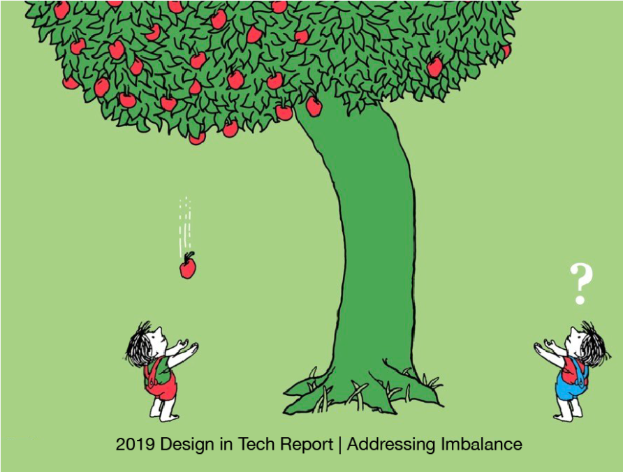
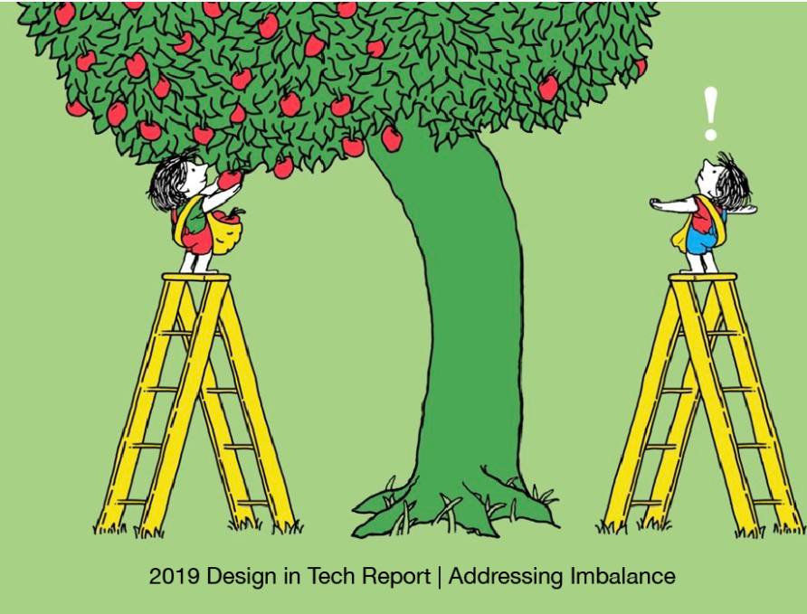
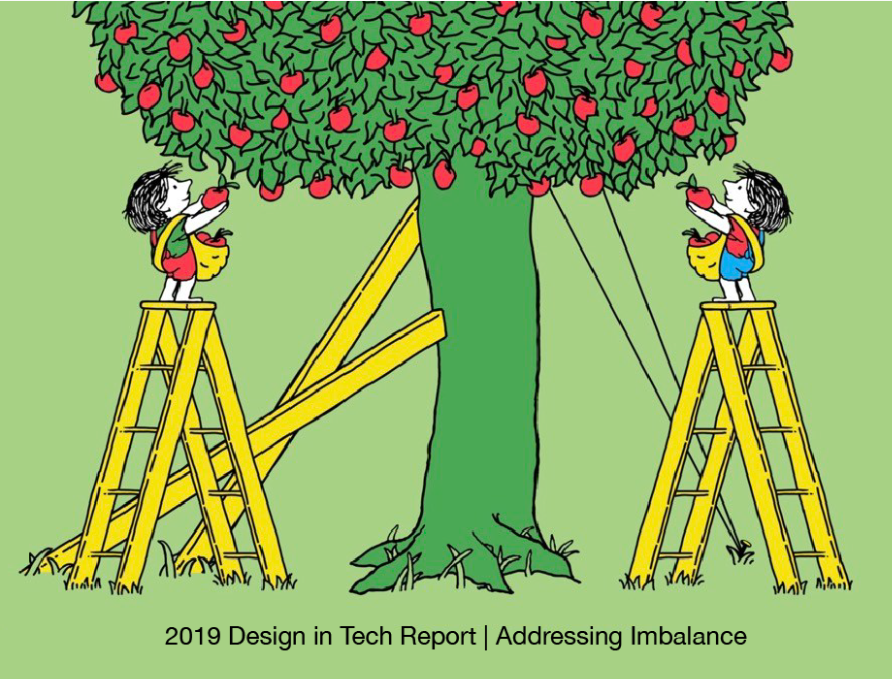
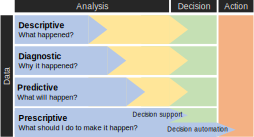
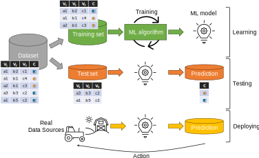
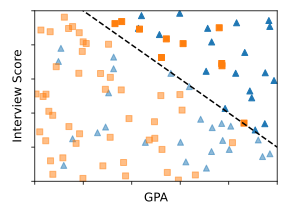
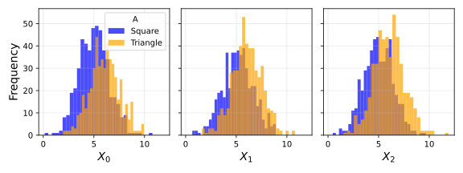
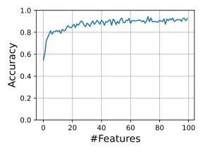

# What is fairness?

#

:::: {.columns}
::: {.column width=25%}

:::

::: {.column width=25%}
::: {.fragment fragment-index=2}

:::
:::
::: {.column width=25%}
::: {.fragment fragment-index=3}

:::
:::
::: {.column width=25%}
::: {.fragment fragment-index=4}

:::
:::
::::

# 

:::: {.columns}
::: {.column width=50%}
*Equality*: the state of being equal, especially in status, rights, or opportunities.

:::
::: {.column width=50%}
*Equity*: the state of having exact resources and opportunities needed to reach an equal outcome.

:::
::::

**Fairness**: *impartial* and *just* treatment or behaviour without favouritism or discrimination.

# How does fairness impact data-driven decision making?

# Data-driven decision making

When making (institutional) decisions, we *must avoid arbitrarity*

- *Arbitrary decisions* are based on individual discretion rather than a fair application of regulations.

> A bank must decide whether to loan money.
>
> - (Legitimacy) Is it legitimate if the bank's employees loan money only to customers with red shoes?
> - (Inconsistency) Is it legitimate if the bank's employees loan money based on whether they are happy day by day?

:::{.fragment}
*Institutions* (firms to governments) usually represent populations as *tables* (*rows*: individuals, *columns*: measurements about them).

> Over the years, the bank has collected data about customers ([Adult](https://archive.ics.uci.edu/dataset/2/adult) dataset: predicting `income` based on personal data).
>
> |   `age` | `education`   | `occupation`        | `relationship`   | `race`   | `sex`    |... | `country` | `income`   |
> |------:|:------------|:------------------|:---------------|:-------|:-------|---:|:--------|:---------|
> |    39 | Bachelors   | Adm-clerical      | Not-in-family  | White  | Male   |... | US      | <=50K    |
> |    50 | Bachelors   | Exec-managerial   | Husband        | White  | Male   |... | US      | <=50K    |
> |    38 | HS-grad     | Handlers-cleaners | Not-in-family  | White  | Male   |... | US      | <=50K    |
> |    53 | 11th        | Handlers-cleaners | Husband        | Black  | Male   |... | US      | <=50K    |
> |    28 | Bachelors   | Prof-specialty    | Wife           | Black  | Female |... | Cuba    | <=50K    |
>
> Can we systematically use the `income` prediction to decide whether to loan money? What are the risks?
:::

# Data-driven decision making

To avoid arbitrary decisions, *institutional decision making* has long been formalized via *bureaucratic* procedures.

- Bureaucracy arose in part *as a response to the subjectivity, arbitrariness, and inconsistency* of human decision making.
- Institutionalized rules and procedures aim to minimize the effects of humans' frailties as individual decision makers [52].
    - *Procedural protections* ensure that decisions are made transparently, on the basis of the *right and relevant information*.

> The fully developed bureaucratic apparatus compares with other organisations exactly as does the machine with the non-mechanical modes of production.
>
> Max Weber [@waters2015weber]

Weber's *ideal-typical bureaucracy* is characterized by several factors, including

- *all decisions* and powers *specified and restricted by regulations*
- *officials with expert training* in their fields

**Question**: which role can ML play in decision making?

# Machine learning

Do humans always take optimal decisions?

::: {.fragment}
- Volumes of academic papers speak to the evident biases of human decision makers.

*Entire disciplines have embraced mathematical models of optimal decision making* in their theoretical foundations.

- We can label deviations from mathematical optimality as "bias" that requires attention.

**Machine learning** adds a repertoire of heuristics that *learns decision rules from sufficiently large datasets*

- Techniques for fitting huge statistical models on large datasets have led to impressive achievements.
- Many applications: image classification, speech recognition, and natural language processing etc.

A body of research *compared the accuracy of statistical models to the judgments of humans*, even with years of experience.

- In many head-to-head comparisons, *data-driven decisions are more accurate than those based on intuition or expertise*.
- A 2002 study shows that **automated** underwriting of loans was both more accurate and less racially disparate.
    - These results have been welcomed as a way to ensure that high-stakes decisions that shape our lifes are *accurate* and *fair*.
:::

# Automation: When Is Automated Decision Making Legitimate?

When building a data-driven system, there are several levels of analytics and automation

- We mainly refer to *predictive* and *prescriptive* analytics

# Automation: When Is Automated Decision Making Legitimate?

Is it fair/legitimate to deploy automated decisions at all?

- Decision making about people involves exercising power over them, so it is important to ensure legitimacy.
- The more power a firm (e.g., Facebook) has over individuals, the more that power needs to be perceived as legitimate.

> Apple made it harder for Facebook to track users on iOS, putting a dent in its revenue [49]. This move enjoyed public support despite Facebook's vociferous protests, arguably because the underlying business model had lost legitimacy.

> Improving facial analysis technology to decrease the disparity in error rates between racial groups is not a useful response to concerns about the use of such technologies for oppressive purposes [50].

# Automation: When Is Automated Decision Making Legitimate?

> Hiring, credit, and admissions decisions are rarely left to one person to make on their own as they see fit. Instead, these decisions are guided by formal rules and procedures, involving many actors with prescribed roles and responsibilities.

Strawman view: decisions based on ML are analogous to decision making by humans, and so ML doesn't warrant special attention.

::: {.fragment}
- While it's true that ML models might be difficult for people to understand, humans are black boxes, too.
- While there can be systematic bias in ML models, they are often demonstrably less biased and arbitrary than humans.
    - E.g., arbitrariness might refer to decisions made on an inconsistent or ad hoc basis.
    - E.g., arbitrariness might refer to lacking reasoning, even if the decisions are made consistently on that basis.

We discuss two main issues about automation:

- The criteria of automation
- How we achieve automation
:::

# Automation: The criteria of automation

1. *Procedural regularity* [55]: whether a decision making scheme is executed *consistently* and *correctly*.

    - In inconsistent decision making, individuals receive different decisions simply because they happen to go through the decision-making process at different times.
    - However, people should be entitled to similar decisions unless there are reasons to treat them differently.

2. Existance of *good (or any) reasons* explaining why the decision-making scheme looks the way that it does

    > A coach consistently picks a track team based on the color of runners' sneakers.
    > However, the color of shoes does not help advance the decision maker's goals.

    - In the context of government decision making, there is often a legal requirement that there be a rational basis for decision making—that is, that there be good reasons for making decisions in the way that they are [54]

# Automation: How do we achieve automation?

How can we formalize decision making to enable automation via computing?

> The nature of computing is such that it requires explicit choices about inputs, objectives, constraints, and assumptions in a system" [73]

::: {.fragment}
There are (at least) three different types of automation via computing

1. Translating decision-making rules that have worked out through a traditional policy-making process into software [56].
2. Learning how to replicate the informal judgements of humans.
3. Learning decision-making rules from data.
:::

# Automation: How do we achieve automation?

1\) Translating decision-making rules that have worked out through a traditional policy-making process into software [56].

- The rules are set by humans, but their application is automated by a computer (ML has no role here).
- This is a response to arbitrariness as inconsistency, but it does not ensure that the policy itself is a reasoned one.
- Automating the execution of a preexisting decision-making scheme requires translating such a scheme into code.
    - Programmers might make errors in that process, leading to automated decisions that diverge from the original policy.
    - In the face of ambiguity, programmers might take it upon themselves to make their own judgment.

> Hundreds of British postmasters were convicted for theft or fraud over a twenty-year period based on flawed software in what has been called the biggest miscarriage of justice in British history [57]

# Automation: How do we achieve automation?

2\) Learning how to replicate the informal judgements of humans.

- Learn a decision-making scheme that produces the same decisions as humans have made in the past
- ... implements this scheme in software to replace the humans who had been making these decisions

> An educational institution may want to automate the process of grading essays, and it may attempt to do that by relying on ML to learn to mimic the grades teachers have assigned to similar work in the past.

A few decades ago, expert-systems relied on explicitly encoding the reasoning that humans relied on to make decisions [66]

- "Expert" systems failed for many reasons, including the fact that people aren't always able to explain their own reasoning [67].
- Expert systems eventually gave way to the approach of simply asking people to label examples and having learning algorithms discover how to best predict the label that humans would assign.

ML can learn how a human would make a decision, given a preexisting but informal process for making decisions.

- The goal isn't to perfectly recover the specific weight that past decision makers had implicitly assigned to different criteria,
- ... but to ensure that the model produces a similar set of decisions as humans.
- Risk of replicating and exaggerating any objectionable qualities of human decision making by learning from the bad examples
- Relying on past human decisions does not guarantee that automated decision making will reflect reasoned judgments.

# Automation: How do we achieve automation?

3\) Learning decision-making rules *only from data* (predictive optimization; not necessarily applying them).

- It does not rely on an existing bureaucratic decision-making scheme or human judgment where decision makers have some (amorphous and hard to specify) goal and would like to develop an explicit decision-making scheme to help realize their goal
    - They engage in discussion to come to some agreement about the criteria (and weight) that are relevant to the decision

Use ML to uncover patterns in a dataset that predict an outcome of interest and then bases decisions on those predictions.

- The relevant point of automation, in this case, is in the process of *learning* the rules, not necessarily applying them.
- It requires a *clear target* that is aligned with the *goals* that decision makers have in mind.
    - "Good" decisions are those that accurately predict the target.
        - Decision-making can be "good" for reasons beyond the goal, such as enabling understanding or contesting the policy.
    - Identifying a target of prediction aligned with the goals is rarely straightforward.
        - Decision makers often don't have a preexisting, clear, and discrete goal in mind [75].
        - When they do, the goal can be far more complex and multifaceted than one discrete and easily measurable outcome [76].
        - You can have multiple conflicting goals, perhaps involving some trade-offs between them.

> The decision-making schemes adopted by college admission officers often encode a range of different goals.
> They do not simply rank applicants by their predicted GPA and then admit the top candidates to fill the physical capacity of the school.
> Aside from the obvious fact that this would favor candidates who take "easy" classes, admissions officers aim to recruit a student body with diverse interests and a capacity to contribute to the broader community.

# Automation: When Is Automated Decision Making Legitimate?

Automation requires that an institution determine in advance all of the criteria that a decision-making scheme will take into account; 

- There is no room to consider the relevance of additional details that might not have been contemplated or anticipated at the time that the software was developed.
- Automated decision making is thus likely to be much more brittle than decision making that involves manual review because it limits the opportunity for decision subjects to introduce information into the decision-making process.
- Discretion is valuable in these cases because humans are often able to reflect on the relevance of additional information to the decision at hand and the underlying goal that such decisions are meant to serve.
    - Human review leaves room to expand the criteria under consideration and to reflect on when the mechanical application of the rules fails to serve their intended purpose [59, 61].
- Automation can also restrict people's ability to point out errors or to challenge the ultimate decision [62]
- Automation runs the serious risk of limiting accountability and exacerbating the dehumanizing effects of dealing with bureaucracies.
    - Automation can make it difficult to identify the agent responsible for a decision; software often has the effect of dispersing the locus of accountability because the decision seems to be made by no one [64].

> Consider a well-known study by Ziad Obermeyer, Brian Powers, Christine Vogeli et al. on bias in an algorithm employed by a health care system to predict which patients would benefit most from a "high-risk care management" program [81].
>
> - They found that the algorithm exhibited racial bias—specifically, that it underestimated the degree to which Black patients' health would benefit from enrollment in the program.
> - That's because the developers adopted health care costs as the target of prediction, on the apparent belief that it would serve as a reasonable proxy for health care needs.
> - The common recounting of this story suggests that decision makers simply failed to recognize the fact that there are racial disparities in both care seeking and the provision of health care that cause Black patients of equivalently poor health to be less > expensive than non-Black patients

# Machine learning

**ML is a way to learn and make decisions about individuals directly from the data**.

- Rather than *manually formalizing* the relationship between *relevant factors* and an *outcome*, *ML defers the question of relevance to the data*
- Which factors (among *all* that we have observed) bear a statistical relationship to the outcome?

> :::: {.columns}
> ::: {.column width=40%}
> 
> :::
> ::: {.column width=60%}
> We may be able to effortlessly identify objects in a scene, but we are unable to specify the full set of rules that we rely on to make these determinations.
> We cannot hand-code a program that exhaustively enumerates all the relevant factors that allow us to recognize objects from every possible perspective or visual configurations.
> ::: 
> :::: 

Interrogating ML is a way of interrogating institutional decision making in society today and for the foreseeable future.

- We do not compare ML models to the subjective judgments of individual humans but instead to institutional decision making.

# What is machine *learning*?

*Learning* is not a process of simply committing examples to memory.

- *Induction*: drawing rules (from past examples) that effectively account for past cases, but that also apply to new/unseen cases.
- E.g., Homing in on those details that are characteristic of "2" in general, not just the "2"s that appear in the examples.

When learning, ML turns *data into a model*.

- A model summarizes the patterns in the training data; *it makes generalizations*.
- A model could take many forms: a hyperplane, or a set of distributions, a set of weights, etc.

There are reasons to be cautiously optimistic about fairness and machine learning.

- Data-driven decision making has the potential to be more transparent compared to human decision making.
- It forces us to articulate our decision-making objectives and enables us to clearly understand the trade-offs between desiderata.

Challenges: 

- One challenge is improving the interpretability and explainability of modern machine learning methods, which is a topic of vigorous ongoing research.
- Another challenge arises from the proprietary nature of datasets and systems that are crucial to an informed public debate on this topic.

# Machine Learning

Supervised machine learning is a form of inductive reasoning.

- It aims to draw general rules from a set of specific examples, identifying the features and feature values that reliably co-occur with an outcome of interest.
- As it turns out, the limitation of being insufficiently individualized is an unavoidable part of inductive reasoning.

"Statistically sound but nonuniversal generalizations": when an individual fulfills all the criteria for inclusion in a particular group but fails to possess the quality that these criteria are expected to predict [82].

- Even if we accept that decisions can never be fully individualized, we might still expect that decision makers take into account the full range of relevant information at their potential disposal.

> To carry forward the example above, we might say that the car insurance company had an obligation to consider the applicants' driving skills, not just the model and color of their car, even if doing so still meant that they were being assessed according to how often other people with similar driving skills
> Collecting and considering all of this information can be expensive, intrusive, and impractical.
> In fact, the cost of doing so could easily outweigh the perceived benefits that come from more granular decision making—not just to the decision maker but to the subjects of the decisions as well
> For instance, if developing a much more detailed assessment of applicants for car insurance increases the operating costs of the insurer, the insurer is likely to charge applicants a higher price to offset these additional costs.

Limits to inductive reasoning.

- This is the problem of overfitting [84]
- This is the problem of "distribution shifts," of which there are many different kinds.

# Machine Learning

After learning, we make predictions and take *action*s based on the model's predictions to new, unseen inputs.

A typical model deployed in practice may have an accuracy (more precisely, AUC) of between 0.7 and 0.8 [91].

- That's better than a coin toss but still results in a substantial number of false positives and false negatives.

> A claim that the system makes the most accurate decision possible at the time of screening is cold comfort to families where children are separated from their parents due to the model's prediction of future abuse, or cases of abuse that the model predicted to be low risk.

- If the model's outputs were random, we would clearly consider it arbitrary and illegitimate (and even cruel).
- What is the accuracy threshold for legitimacy? In other words, how high must accuracy be in order to be able to justify the use of a predictive system at all [92]?

#

# Relative Notions of Fairness

Discussions of *discrimination* in the context of ML can seem odd if you consider that the very point of ML applications is to figure out how to treat different people differently—that is, to discriminate between them.

However, what we call discrimination is not different treatment in and of itself, but rather treatment that systematically imposes a disadvantage on one social group relative to others.

- First, a person might be subject to the prejudice of an individual decision maker
- Second, a person might encounter systematic barriers to entering certain occupations, perhaps because members of the group to which they belong are not viewed as fit regardless of their true capabilities or potential
- Certain personal characteristics might be an organizing principle for society overall such that members of certain groups are systematically excluded from opportunities across multiple spheres of life.

- Race and gender—among others enumerated in discrimination law and described in more detail in chapter 6—rise to such a level because they have served as the basis for perpetuating systematic relative disadvantage across the board.
- In extreme cases, certain characteristics can provide the foundations for a strict social hierarchy in which members of different groups are slotted into more or less desirable positions in society.
- Such conditions can create the equivalent of a caste system [141], in which certain groups are confined to a permanent position of relative disadvantage.

> For example, children are often assumed to belong to the same racial group as their biological parents, making the relative disadvantage that people may experience due to their race especially systematic: children born into families that have been unfairly deprived of resources and opportunities will have less access to these resources and opportunities, thereby limiting from the start of their lives how effectively they might realize their potential

# Relative Notions of Fairness

*Relevance*: perhaps the most common reason to object to discrimination is because it relies on characteristics that bear little to no relevance to the outcome or quality that decision makers might be trying to predict or assess [141, 142].

> For example, one reason why it might be wrong to base employment decisions on characteristics like race or gender is that these characteristics bear no relevance to determinations about job applicants' capacity to perform the job.

*Generalizations*: Or we might argue that the harm lies in the needlessly coarse groupings perpetuated by decisions made on the basis of race or gender, even if these can be shown to possess some statistical relevance to the decision at hand [82].

- People deserved to be treated as individuals and assessed on their unique merits.
- The intuitive idea of a perfectly individualized assessment is unattainable.
- Any form of judgment based on individual characteristics must draw on some generalizations and past experience.

*Prejudice*: Another common argument for why discrimination is wrongful is that it amounts to a form of prejudicial decision making, in which members of certain groups are presumed to be of inferior status.

- This is not a problem of granularity but a problem of beliefs, in which decision makers hold entire groups in lesser regard than others.

*Immutability*: discrimination is wrongful is because it involves treating people differently according to characteristics over which they possess no control.

#

Can *automated actions* cause disparities?

- Two key questions to ask: are disparities *justified* and *harmful*?
- The extensive literature on discrimination in philosophy and sociology can help us reason about them.

# Find the disparities

> **Example**: Amazon uses a data-driven system to determine the neighborhoods in which to offer free same-day delivery to improve efficiency and cost of product distribution.
>
> ::: {.fragment}
> A 2016 investigation found stark *disparities in the demographic makeup of these neighborhoods*: in many US cities, *White residents were more than twice as likely as Black residents to live in one of the qualifying neighborhoods* [3].
> Amazon argued that its system was justified because it was designed based on efficiency and cost considerations and that `race` wasn't an explicit factor.
> Nonetheless, it provides different opportunities to consumers at racially disparate rates.
> The concern is that this might contribute to the perpetuation of long-lasting cycles of inequality.
> If, instead, the system had been found to be partial to ZIP codes ending in an odd digit, it would not have triggered a similar outcry.
> ::: 

# Find the disparities

> **Example**: Street Bump was an app to crowdsource data on potholes in Boston. The smartphone app automatically detects potholes using data from the smartphone's sensors and sends the data to the city.
>
> ::: {.fragment}
> Infrastructure seems like a comfortably boring application of data-driven decision making, far removed from the ethical quandaries we've been discussing.
> *The data are collected by people, and hence reflect demographic disparities*; besides, *the reason we're interested in improving infrastructure in the first place is its effect on people's lives*.
> The data reflect the patterns of smartphone ownership, which are higher in `wealthier` parts of the city compared to lower-income areas and areas with large `elderly` populations [4].
> ::: 

# Find the disparities

> **Example**: Many occupations have stark `gender` imbalances.
>
> ::: {.fragment}
> If we're building a ML system that screens job candidates, we should be keenly aware that this is the baseline we're starting from.
> It doesn't necessarily mean that the outputs of our system will be inaccurate or discriminatory, but we need to pay attention.
> ::: 

What can we do to avoid gender bias?

# Example

> Diagnoses and treatments are sometimes personalized by `race` or `gender`.
>
> `Race` is often used as a crude proxy for ancestry and genetics, and sometimes environmental and behavioral factors [21, 22].
> If we can measure the factors that are medically relevant and incorporate them—instead of race—into statistical models of disease and drug response, we can increase the accuracy of diagnoses and treatments while mitigating racial disparities.

#

When we learn a model from data, are disparities preserved, mitigated, or exacerbated?

- By default, we should expect our models to faithfully reflect disparities found in the input data.
- Some patterns in the training data (smoking is associated with cancer) represent knowledge that we wish to mine using machine learning, while other patterns (girls like pink and boys like blue) represent stereotypes that we might wish to avoid learning.
    - But learning algorithms have no general way to distinguish between these two types of patterns, because the patterns are the result of social norms and moral judgments.
    - Absent specific intervention, machine learning will extract stereotypes, including incorrect and harmful ones, in the same way that it extracts knowledge.

Another common reason why machine learning might perform worse for some groups than others is sample size disparity.

- If we construct our training set by sampling uniformly from the training data, then by definition we'll have fewer data points about minorities.
    - When we develop machine learning models, we typically test only their overall accuracy; so a "5 percent error" statistic might hide the fact that a model performs terribly for a minority group
- Of course, machine learning works better when there are more data, so it will work less well for members of minority groups, assuming that members of the majority and minority groups are systematically different in terms of the prediction task [25].

If we're not careful, learning algorithms will generalize based on the majority culture, leading to a high error rate for minority groups.

- Attempting to avoid this by making the model more complex runs into a different problem: overfitting to the training data, that is, picking up patterns that arise due to random noise rather than true differences.
- One way to avoid this is to explicitly model the differences between groups, although there are both technical and ethical challenges associated with this.
- We see that if a model is calibrated—it faithfully captures the patterns in the underlying data—predictions made using that model will inevitably have disparate error rates for different groups, if those groups have different base rates, that is, rates of positive or negative outcomes.
    - In other words, understanding the properties of a prediction requires understanding not just the model but also the population differences between the groups on which the predictions are applied.

# Example: Fairness as Blindness

You are on a hiring committee to hire applicants based on their college GPA and their interview score

Assumptions:

- *We have data from past candidates to train a ML model* to predict performance scores based on GPA and interview score
- *An applicant's worth can be reduced to a single number* and that we know how to measure that number.
    - **NOTE: This is a valid criticism** and applies to most applications of data-driven decision making today.
    - Big advantage: *once we formulate the decision as a prediction problem, statistical methods tend to do better than humans*.
- *Applicants fall into two demographic groups*, represented by triangles and squares.
    - **NOTE**: when building real systems, enforcing rigid categories of people can be ethically questionable.

# Example: Fairness as Blindness

:::: {.columns}
::: {.column width=50%}

:::
::: {.column width=50%}

We have a dataset with 3 columns, and $C$ is the (sensitive) group

|       GPA |        Interview Score | C        |
|--------:|---------:|:---------|
| 3.75  | 0.31 | square   |
| 9.51 | 6.36   | triangle |
| ... | ... | ... |

Somehow, we have the following classifier

$\text{Hired} = \begin{cases}
1, \text{ if } -A + \epsilon < B \\
0, otherwise
\end{cases}$

**Question**: Is the classifier fair?
:::
::::

::: {.fragment}

- *Fairness-as-blindness*: the classifier didn't take into account $C$ (i.e,. the group of the candidate).
- In this view, the model is fair; a model that gives different scores to identical members of different groups is discriminatory.
:::

# Example: Fairness as Blindness

:::: {.columns}
::: {.column width=50%}

:::
::: {.column width=50%}

:::: {.columns}
::: {.column width=49%}

Predicted Class = 1: $-A + \epsilon > B$

| C        | count |
|:---------|------:|
| square   |    10 |
| triangle |    19 |

:::
::: {.column width=49%}

Predicted Class = 0: $-A + \epsilon \le B$

| C        | count |
|:---------|------:|
| square   |    46 |
| triangle |    25 |

:::
::::

:::
::::

**Question**: are candidates from the two groups equally likely to be positively classified?

::: {.fragment}

- No triangles are more likely to be selected than the squares.
- Guidelines from the US Equal Employment Opportunity Commission: if the probability of selection for two groups differs by more than 20 percent, it might constitute a sufficient impact to initiate a lawsuit.

:::

# Example: Fairness as Blindness

The disparity *might originate from before the candidates were hired*.

- For example, it might arise from disparities in educational institutions attended by the two groups.
    - GPA is correlated with the demographic sensitive attribute—it's a proxy.
- Perhaps we could simply omit that variable as a predictor?
    - In real datasets, most attributes tend to be proxies for demographic variables, and dropping them may not be reasonable.

Another approach would be to *pick different cutoffs so that candidates from both groups have the same probability of being hired*.

- The different-thresholds approach is unsatisfying since it uses the group attribute as the sole criterion for redistribution.
- It does not account for the reasons why 2 candidates with the same attributes (except for group) deserve different treatment.

*Why* the company wants to decrease the demographic disparity in hiring?

- *One answer is rooted in justice to individuals* and the specific social groups to which they belong.
- But a different answer comes from *the firm's selfish interests: diverse teams work better* [33, 34].
    - From this perspective, increasing the diversity of the cohort that is hired would benefit the firm and everyone in the cohort.
    - As an analogy with football, picking 11 goalkeepers, even if individually excellent, would make for a poor soccer team.

More generally, there are many possible algorithmic interventions beyond picking different thresholds for different groups.

# 

With that in mind, we might want to check whether any decision-making process leads to disparate outcomes for different groups as a way of potentially smoking out intentional discrimination pursued with the aid of proxies.

- If we discover disparities in outcomes, we might want to check whether the decision-making process was purposefully orchestrated

# Interpretability

An ethical decision-making process might require, among other things, the ability to explain a prediction or decision, which might not be feasible with black box models.

- A major limitation of machine learning is that it reveals only correlations, but we often use its predictions as if they reveal causation
- The prediction affects the outcome (because of the actions taken on the basis of the prediction), and thus invalidates itself.

> The same principle is also seen in the use of machine learning for predicting traffic congestion: if sufficiently many people choose their routes based on the prediction, then the route predicted to be clear will in fact be congested.

- The effect can also work in the opposite direction: the prediction might reinforce the outcome

> If a user clicked on the first link on a page of search results, is that simply because it was first, or because it was in fact the most relevant? This is again a case of the action (the ordering of search results) affecting the outcome (the link(s) the user clicks on).

Bias in feedback might also reflect cultural prejudices, which are of course much harder to characterize than the effects of the ordering of search results.

> A 2016 paper by Kristian Lum and William Isaac analyzed a predictive policing algorithm by PredPol.
> This is one of the few predictive policing algorithms to be published in a peer-reviewed journal, for which the company deserves praise.
> By applying the algorithm to data derived from Oakland police records, the authors found that Black people would be targeted for predictive policing of drug crimes at roughly twice the rate of White people, even though the two groups have roughly equal rates of drug use [30].
> Their simulation showed that this initial bias would be amplified by a feedback loop, with policing increasingly concentrated on targeted areas.
> This is despite the fact that the PredPol algorithm does not explicitly take demographics into account.

Decisions based on immutable characteristics can be cause for concern because they threaten people's agency.

- By definition, there is nothing anyone can do to change immutable characteristics (such as one's country of birth).
- By extension, there is nothing anyone can do to change decisions made on the basis of immutable characteristics.
- Under these circumstances, people are condemned to their fates and are no longer agents of their own lives

Recourse is a related but more general idea about the degree to which people have the capacity to make changes that result in different decisions [93].

- While there is nothing anyone might do to change an immutable characteristic, people might be more or less capable of changing those characteristics that are, in principle, mutable [94, 95].
- Some people might need to expend far more resources than others to obtain the outcome that they want from the decision-making process.
- In some cases, people may never have sufficient resources to achieve this—bringing us back to the same situation discussed above.

> For example, one applicant for credit might be well positioned to move to a new neighborhood so as to make herself a more attractive candidate for a new loan, assuming that the decision-making scheme uses location as an important criterion.
> But another applicant might not be able to do so, for financial, cultural, or many other reasons.

Finally, as mentioned earlier in this section, we might view certain decision-making schemes as unfair if they hold people accountable for characteristics outside their control.
Basic ideas about moral culpability almost always rest on some understanding of the actions that brought about the outcomes of concern

- Or to put it another way: people should be judged only on the basis of factors for which they are morally culpable.

> For example, as Barbara Kiviat has explored, laws in many US states limit the degree to which car insurance providers can take into account "extraordinary life circumstances" when making underwriting or pricing decisions, including such events as the death of a spouse, child, or parent [97].
> These laws forbid insurers from considering a range of factors over which people cannot exercise any control—like a death in the family—but which may nevertheless contribute to someone experiencing financial hardship and thus to increasing the likelihood of making a claim against their car insurance policy in the event of even a minor accident.
> These prohibitions reflect an underlying belief that people should not be subject to adverse decisions if they were not responsible for whatever it is that makes them appear less deserving of more favorable treatment

"Teaching to the test" is a familiar scenario that is an example of gaming.

- Here, the test score is a feature that predicts future performance (say, at a job).
- Assume that the test, in fact, has predictive value, because people who do well at the test tend to have mastered some underlying body of knowledge, and such mastery improves their job performance.
- Teaching to the test refers to methods of preparation that increase the test score without correspondingly increasing the underlying ability that the score is meant to reflect scheme along the dimensions we've laid out: explain how the target relates to goals that all stakeholders can agree on, validate the accuracy of the deployed system, allow methods for recourse, and so forth.

# Classification

What makes classification possible is the existence of patterns that connect the outcome of interest in a population to pieces of information that we can observe.

We formalize classification in two steps.

- The first is to represent a population as a probability distribution.
- The second step is to apply statistics, specifically statistical decision theory, to the probability distribution that represents the population.

The goal of classification is to determine a plausible value for an unknown target Y given observed covariates X.

- Typically, the covariates are represented as an an array of continuous or discrete variables, while the target is a discrete, often binary, value.
- Formally, the covariates X and target Y are jointly distributed random variables.
- This means that there is one probability distribution over pairs of values (x, y) that the random variables (X, Y) might take on.
- This probability distribution models a population of instances of the classification problem.

At the time of classification, the value of the target variable is not known to us, but we observe the covariates X and make a guess \hat{Y} = f(X) based on what we observed.

- The function f that maps our covariates into our guess \hat{Y} is called a classifier, or predictor.
- The output of the classifier is called label or prediction.

Implicit in this formal setup of classification is a major assumption.

- Whatever we do on the basis of the covariates X cannot influence the outcome Y.
- In particular, our prediction \hat{Y} cannot influence the outcome Y.
- This assumption is often violated when predictions motivate actions that influence the outcome

Accuracy is easy to define, but misses some important aspects when evaluating a classifier.

- A classifier that always predicts no traffic fatality in the next year might have high accuracy on any given individual, simply because fatal accidents are unlikely.
- However, it's a constant function that has no value in assessing the risk of a traffic fatality.

> Risk scores need not be optimal or learned from data.
>
> Consider the well-known body mass index, which we owe to Quetelet by the way, which summarizes the weight and height of a person into a single real number (figure 3.2).
>
> - In our formal notation, the features are X = (H, W) where H denotes height in meters and W denotes weight in kilograms.
> - The body mass index corresponds to the score function R = W/H2.
> - We could interpret the body mass index as measuring risk of, say, diabetes.
> - Taking a thresholding of value 30, we might decide that individuals with a body mass index above this are at risk of developing diabetes while others are not.
>     - It does not take a medical degree to worry that the resulting classifier may not be very accurate.
>     - The body mass index has a number of known issues leading to errors when used for classification.
> - We won't go into detail, but it's worth noting that these classification errors can systematically align with certain groups in the population.
>     - For instance, the body mass index tends to be inflated as a risk measure for taller people due to scaling issues.

# Classification

We now turn to one specific concern, namely, discrimination on the basis of membership in specific groups of the population.

- Discrimination is not a general concept.
- It is concerned with socially salient categories that have served as the basis for unjustified and systematically adverse treatment in the past.
- In many classification tasks, the features X implicitly or explicitly encode an individual's status in a protected category.
- We will set aside the letter A to designate a discrete random variable that captures one or multiple sensitive characteristics.
- Different settings of the random variable A correspond to different mutually disjoint groups of the population.
- The random variable A is often called a sensitive attribute in the technical literature.

> Note that formally we can always represent any number of discrete protected categories as a single discrete attribute whose support corresponds to each of the possible settings of the original attributes.
> Consequently, our formal treatment in this chapter does apply to the case of multiple protected categories.
> This formal maneuver, however, does not address the important concept of intersectionality, which refers to the particular forms of disadvantage that members of multiple protected categories may experience [105].

Some have hoped that removing or ignoring sensitive attributes would somehow ensure the impartiality of the resulting classifier.

- Unfortunately, this practice can be ineffective and even harmful.
- Additionally, in a typical dataset, we have many features that are slightly correlated with the sensitive attribute.

# Classification

Imagine that we have the following dataset

| $X_0$ |     $X_1$ |     $X_2$ | $A$    | Class |
|--------:|--------:|--------:|:---------|------:|
| 3.68657 | 6.53609 | 6.18556 | Square   | 0     |
| 2.9258  | 5.88879 | 5.51008 | Square   | 0     |
| 7.38927 | 7.16754 | 6.85592 | Triangle | 1     |
| 8.86412 | 5.17322 | 7.45228 | Triangle | 1     |
| ... | ... | ... | ... | ...     |

Where $A$ is the sensitive attribute and the $Class$ to predict depends on $A$.

**Question**: if we apply a ML model (e.g., random forest) what is the accuracy of the prediction if we include $A$ in the features?

# Classification

Suppose that we drop $A$, but the remaining features are slightly correlated with it

- In both groups (triangles and squares) the feature follows a normal distribution.
- Only the means are slightly different in each group.

**Question**: if we apply a ML model (e.g., random forest) what is the accuracy of the prediction if we drop $A$ from the features?

# Classification

**Question**: if we apply a ML model (e.g., random forest) what is the accuracy of the prediction if we drop $A$ from the features?

:::: {.columns}
::: {.column width=70%}

Multiple features can be used to build a highly accurate group membership classifier.

- On the right, how accuracy grows as more and more features become available.
- In large feature spaces $A$ is generally redundant given the other features.
- If we remove $A$, the classifier will find a redundant encoding of the other features.
- This results in an essentially equivalent classifier.

:::
::: {.column width=30%}

:::
::::

**Take away**: What we learn from this is that machine learning can wind up building classifiers for sensitive attributes without explicitly being asked to, simply because it is an available route to improving accuracy.

- That does not mean that removing it is a good idea.

> Medication, for example, sometimes depends on race in legitimate ways if these correlate with underlying causal factors [21].
> Forcing medications to be uncorrelated with race in such cases can harm the individual.

# Classification

Statistical nondiscrimination criteria are properties of the joint distribution of the sensitive attribute A, the target variable Y, the classifier \hat{Y} or score R, and in some cases also features X.

- This means that we can unambiguously decide whether or not a criterion is satisfied by looking at the joint distribution of these random variables.
- Equalize acceptance rates across all groups.

This corresponds to imposing the constraint for all groups a and b:

$P\{\hat{Y}=1|A=a\}=P\{\hat{Y}=1|A=b\}$

In the case where $\hat{Y} \in \{0, 1\}$ is a binary classifier and we have two groups $a$ and $b$

- we can determine if acceptance rates are equal in the two groups by knowing the three probabilities $P\{\hat{Y} = 1, A = a\}$, $P\{\hat{Y} = 1, A = b\}$, and $P\{A = a\}$ that fully specify the joint distribution of $\hat{Y}$ and $A$.

There are essentially three fundamentally different ones equalizing one of the following three statistics across all groups: 

- Acceptance rate $P\{\hat{Y} = 1\}$ of a classifier $\hat{Y}$;
- Error rates $P\{\hat{Y} = 0 | Y= 1\}$ and $P\{\hat{Y} = 1 | Y= 0\}$ of a classifier $\hat{Y}$;
- Outcome frequency given score value $P\{Y= 1 | R = r\}$ of a score $R$.

When applied to a binary classifier $\hat{Y}$, *independence* is often referred to as demographic parity, statistical parity, or group fairness, disparate impact, among other terms.

$P\{\hat{Y}=1|A=a\}=P\{\hat{Y}=1|A=b\}$

A relaxation of the constraint introduces a positive

$P\{\hat{Y}=1|A=a\} \ge P\{\hat{Y}=1|A=b\} - \epsilon$

$\frac{P\{\hat{Y}=1|A=a\}}{P\{\hat{Y}=1|A=b\}} \ge 1 - \epsilon$

- Some have argued that, for $\epsilon = 0.2$, this condition relates to the 80 percent rule that appears in discussions around disparate impact law [107].
- Another way to state the independence condition in full generality is to require that $A$ and $R$ must have zero mutual information $I(A; R) = 0$.

> Imagine a company that in group a hires diligently selected applicants at some rate p > 0.
> In group b, the company hires carelessly selected applicants at the same rate p.
> Even though the acceptance rates in both groups are identical, it is far more likely that unqualified applicants are selected in one group than in the other.
> As a result, it will appear in hindsight that members of group b performed worse than members of group a, thus establishing a negative track record for group b.

# Separation

The target variable $Y$ suggests one way of partitioning the population into strata of equal claim to acceptance.

- Viewed this way, the target variable gives us a sense of merit.
- A particular demographic group ($A = a$) may be more or less well represented in these different strata.
- A decision maker might argue that in such cases it is justified to accept more or fewer individuals from group $a$.

Who bears the cost of misclassification? 

In case of binary classifier, separation requires two constraints:

\begin{align}
P\{\hat{Y}=1|Y=1,A=a\}=P\{\hat{Y}=1|Y=1,A=b\}\\
P\{\hat{Y}=1|Y=0,A=a\}=P\{\hat{Y}=1|Y=0,A=b\}
\end{align}

Where 

- $P\{\hat{Y}=1|Y=1\}$ is the TP rate at which the classifier correctly recognizes positive instances.
    - The TP rate equals 1 - FN rate.
- $P\{\hat{Y}=1|Y=0\}$ is the FP rate at which the classifier mistakenly assigns positive outcomes to negative instances.
    - When identifying high-risk individuals (e.g., for loan default prediction), the undesirable outcome is the "positive" class.
    - A FN, intuitively speaking, corresponds to a denied opportunity in scenarios where acceptance is desirable, such as in hiring.
    - This inverts the meaning of FP and FN, and is a frequent source of terminological confusion.

Intuitively,

- Separation requires that all groups experience the same FN and FP rates.
- Consequently, the definition asks for *error rate parity*
- A violation of separation highlights the fact that different groups experience different costs of misclassification.

# Separation

The act of measuring and reporting group-specific error rates can create an incentive for decision makers to work toward improving error rates through collecting better datasets and building better models.

- If there is no way to improve error rates in some group relative to others, this raises questions about the legitimate use of machine learning in such cases.

- It's important not to interpret the score as an individual probability.
    - Calibration does not tell us anything about the outcome of a specific individual that receives a particular value.

# How to Satisfy a Nondiscrimination Criterion?

We distinguish between three different techniques.

- *Preprocessing*: Adjust the feature space to be uncorrelated with the sensitive attribute.
- *In-training*: Work the constraint into the optimization process that constructs a classifier from training data.
- *Post-processing*: Adjust a learned classifier so as to be uncorrelated with the sensitive attribute.

# How to Satisfy a Nondiscrimination Criterion?

Preprocessing is a family of techniques to transform a feature space into a representation that as a whole is independent of the sensitive attribute.

- This approach is generally agnostic to what we do with the new feature space in downstream applications.
- After the preprocessing transformation ensures independence, any deterministic training process on the new space will also satisfy independence.
- This is a formal consequence of the well-known data-processing inequality from information theory.
[113]

# How to Satisfy a Nondiscrimination Criterion?

Achieving independence at training time can lead to the highest utility since we get to optimize the classifier with this criterion in mind.

- The disadvantage is that we need access to the raw data and training pipeline.
- We also give up a fair bit of generality as this approach typically applies to specific model classes or optimization problems.

Postprocessing refers to the process of taking a trained classifier and adjusting it possibly depending on the sensitive attribute and additional randomness in such a way that independence is achieved.

- Formally, we say a derived classifier $\hat{Y} = F(R, A)$ is a possibly randomized function of a given score $R$ and the sensitive attribute $A$.

- Given a cost for FN and FP, we can find the derived classifier that minimizes the expected cost of FP and FN subject to the fairness constraint at hand.

#

Credit scores support lending decisions by giving an estimate of the risk that a loan applicant will default on a loan.
Credit scores are widely used in the United States and other countries when allocating credit, ranging from micro loans to jumbo mortgages.

The Equal Credit Opportunity Act, a United States law enacted in 1974, makes it unlawful for any creditor to discriminate against any applicant the basis of race, color, religion, national origin, sex, marital status, or age.

Since the score model is proprietary, it is not clear what target variable was used during the training process.
What is it then that the score is trying to predict? In a first reaction, we might say that the goal of a credit score is to predict a default outcome.
However, that's not a clearly defined notion.
Defaults vary in the amount of debt recovered and the amount of time given for recovery.
Any single binary performance indicator is typically an oversimplification.

[the] measure is based on the performance of new or existing accounts and measures whether individuals have been late 90 days or more on one or more of their accounts or had a public record item or a new collection agency account during the performance period.

We see that the shapes appear roughly visually similar in the groups, although the "White" group encloses a noticeably larger area under the curve than the "Black" group.
Also note that even two ROC curves with the same shape can correspond to very different score functions.
A particular trade-off between true positive rate and false positive rate achieved at a threshold t in one group could require a different threshold t′ in the other group.

Comparison of Different Criteria With the score data at hand, we compare four different classification strategies: Maximum profit: Pick possibly group-dependent score thresholds in a way that maximizes profit.
Single threshold: Pick a single uniform score threshold for all groups in a way that maximizes profit.
Independence: Achieve an equal acceptance rate in all groups.
Subject to this constraint, maximize profit.
Separation: Achieve an equal true/false positive rate in all groups.
Subject to this constraint, maximize profit.

# 5. Causality

Historical data show that 12,763 applicants were considered for admission to one of 101 departments and interdepartmental majors.

- Of the 4,321 women who applied, roughly 35 percent were admitted
- Of the 8,442 men who applied, roughly 44 percent were admitted

Standard statistical significance tests suggest that the observed difference would be highly unlikely to be the outcome of sample fluctuation if there were no difference in underlying acceptance rates.

- A similar pattern exists if we look at the aggregate admission decisions of the six largest departments.
- The acceptance rate across all six departments for men is about 44 percent, while it is roughly only 30 percent for women, again a significant difference.

| Department | Applied (Men) | Applied (Women) | Admitted % (Men) | Admitted % (Women) |
|------------|---------------|-----------------|------------------|--------------------|
| A          | 825           | 108             | 62               | **82**             |
| B          | 520           |  25             | 60               | **68**             |
| C          | 325           | 593             | **37**           | 34                 |
| D          | 417           | 375             | 33               | **35**             |
| E          | 191           | 393             | **28**           | 24                 |
| F          | 373           | 341             |  6               |  **7**             |

- We can see from the table that four of the six largest departments show a higher acceptance ratio for women, while two show a higher acceptance rate for men.
- However, these two departments cannot account for the large difference in acceptance rates that we observed in aggregate.
- So, it appears that the higher acceptance rate for men that we observed in aggregate seems to have reversed at the department level.

Such reversals demonstrate what is sometimes called Simpson's paradox

- $P\{Y| A} < P\{Y | ¬A\}$
- $P\{Y| A, Z = z\} > P\{Y | ¬A, Z = z\}$ for all values z that the random variable Z assumes.

The reason why Simpson's paradox is relevant to our discussion is that it's a consequence of how we tend to misinterpret what information conditional probabilities encode.

- Recall that a statement of conditional probability corresponds to passive observation.
- What we see here is a snapshot of the normal behavior of women and men applying to graduate school at UC Berkeley in 1973.
- What is evident from the data is that gender influences department choice.
- Women and men appear to have different preferences for different fields of study.
- Moreover, different departments have different admission criteria. Some have lower acceptance rates, some higher.
- Therefore, one explanation for the data we see is that women chose to apply to more competitive departments, and hence were rejected at a higher rate than men.
- The bias in the aggregated data stems not from any pattern of discrimination on the part of admissions committees, quite fair on the whole, but apparently from prior screening at earlier levels of the educational system.
[175]

There is no way of knowing what was the case from the data we have.

- There are multiple possible scenarios with different interpretations and consequences that we cannot distinguish from the data at hand.

- One is to design a new study and collect more data in a manner that might lead to a more conclusive outcome.
- The other is to argue over which scenario is more likely, based on our beliefs and plausible assumptions about the world.

# Testing Discrimination in Practice

There is no single test for fairness, that is, there is no single criterion that is both necessary and sufficient for fairness.

- If a system passes a fairness test, we should not interpret it as a certificate that the system is fair.
- There are many criteria that can be used to diagnose potential unfairness or discrimination.
    - We need moral reasoning and domain-specific considerations to determine which test(s) are appropriate, how to apply them, determine whether the findings indicate wrongful discrimination, and whether an intervention is called for.
- There's often a gap between moral notions of fairness and what is measurable by available experimental or observational methods.

# Testing Discrimination in Practice: Auditing

**Audit study** is a popular technique for diagnosing discrimination in a *field* experiment.

- Field experiments allow us to study decision making as it actually happens rather than worrying that what we're discovering is an artifact of a lab setting.
- At the same time, the experiment, by carefully manipulating and controlling variables, allows us to observe a treatment effect, rather than merely observing a correlation.
- Experiments on real systems are hard to pull off.
    - For example, we usually have to keep participants unaware that they are in an experiment.

Most audit studies are best seen as attempts to test blindness: whether a decision maker directly uses a sensitive attribute.

> The researchers recruited thirty-eight testers to visit about 150 car dealerships to bargain for cars, and record the price they were offered at the end of bargaining [293].
> Testers visited dealerships in pairs; testers in a pair differed in terms of race or gender.
> Both testers in a pair bargained for the same model of car, at the same dealership, usually within a few days of each other.
> Pulling off an experiment such as this in a convincing way requires careful attention to detail; here we describe just a few of the many details in the paper.
> Most significantly, the researchers went to great lengths to minimize any differences between the testers that might correlate with race or gender.
> In particular, all testers were between twenty-eight and thirty-two years old, had three our four years of postsecondary education, and "were subjectively chosen to have average attractiveness." Further, to minimize the risk of testers' interaction with dealers being correlated with race or gender, > every aspect of their verbal or nonverbal behavior was governed by a script.
> For example, all testers "wore similar ‘yuppie' sportswear and drove to the dealership in similar rented cars." They also had to memorize responses to a long list of questions they were likely to encounter.
> All of this required extensive training and regular debriefs.
> The paper's main finding was a large and statistically significant price penalty in the offers received by Black testers.
> For example, Black males received final offers that were about $1,100 more than White males, which represents a threefold difference in dealer profits based on data about dealer costs.

# Testing Discrimination in Practice: Auditing

A tempting interpretation of this study is that if two people were identical except for race, with one being White and the other being Black, then the offers they should expect to receive would differ by about $1,100.

- But what does it mean for two people to be identical except for race? Which attributes about them would be the same, and which would be different?
- But what if one of the mechanisms of what we understand as "racial discrimination" is based on attire and behavior differences? The social construction of race suggests that this is plausible [294].

Our point is this: the design and interpretation of audit studies requires taking positions on contested social questions.

It may be futile to search for a single "correct" way to test even the seemingly straightforward fairness notion of whether the decision maker treats similar individuals similarly regardless of race.

- Controlling for a plethora of attributes is one approach.
- Arguably, it yields lower bounds on the amount of discrimination since it incorporates a thin conception of race.
- Another is to simply recruit Black testers and White testers, have them behave and bargain as would be their natural inclination, and measure the demographic disparit

> Another famous audit study by Marianne Bertrand and Sendhil Mullainathan tested discrimination in the labor market [295].
> Instead of sending testers in person, the researchers sent in fictitious résumés in response to job ads.
> Their goal was to test if an applicant's race had an impact on the likelihood of an employer inviting them for an interview.
> They signaled race in the résumés by using White-sounding names (Emily, Greg) or Black-sounding names (Lakisha, Jamal).
> White names were 50 percent more likely to result in a callback than Black names.
> The magnitude of the effect was equivalent to an additional eight years of experience on a résumé.

> For example, a study looked at decisions made by judges in Louisiana juvenile courts, including sentence lengths [304].
> It found that in the week following an upset loss suffered by the Louisiana State University (LSU) football team, judges imposed sentences that were 7 percent longer on average.
> The impact was greater for Black defendants.
> The effect was driven entirely by judges who got their undergraduate degrees at LSU, suggesting that the effect is due to the emotional impact of the loss.
> For readers unfamiliar with the culture of college football in the United States, the paper helpfully notes that "Describing LSU football just as an event would be a huge understatement for the residents of the state of Louisiana
> The study tested the relationship between the order in which parole cases are heard by judges and the outcomes of those cases [305].
> It found that the percentage of favorable rulings started out at about 65 percent early in the day before gradually dropping to nearly zero
> Right before the judges' food break, returned to around 65 percent after the break, with the same pattern repeated for the following food break! The authors suggested that judges' mental resources are depleted over the course of a session, leading to poorer decisions.
> It quickly became known as the "hungry judges" study and has been widely cited as an example of the fallibility of human decision makers (figure 7.1).
> A follow-up investigation revealed multiple confounders and potential confounders, including the fact that prisoners without an attorney are presented last within each session, and tend to prevail at a much lower rate [307].
> This invalidates the conclusion of the original study.

#

Machine learning algorithms (e.g., classifiers) make predictions about new data *by training on old data*.

- These predictions may be hiring or not hiring, good or bad credit, and so on.

However, the training data may contain patterns such as a higher rate of good outcomes for members of certain groups.

This is quantified by the "80% rule" of disparate impact, which is a legal measure and definition of bias.

- $\frac{\text{Rate of unprivileged applicants receiving good outcome}}{\text{Rate of privileged applicants receiving good outcome}} < 0.8$

It is ethically and legally undesirable for a classifier to learn these biases from the data.

We propose two methods of modifying data, called Combinatorial and Geometric repair.
We test our repairs on three data sets.
Experiments show that our repairs perform favorably in terms of training classifiers that are both accurate and unbiased.

# Regulations

Regulation without enforcement is meaningless.
We have to go beyond obsession for regulation.

# Racism

Racism and AI: Bias from the past leads to bias in the future.
https://www.ohchr.org/en/stories/2024/07/racism-and-ai-bias-past-leads-bias-future

# Datasets

Can we change our datasets?
Images on the internet are even more sexist than texts.
You go back in time, how would that community be like when taking selfies.

From training to teaching AI

*Training*

- Repetition and optimization
- Reproductive approach

*Teaching*

- Dialogic and social processes
- Reflexive approach
- Data as communicative practices
- Data encodes values, contexts, and cultures
- Goal of diversification

De-biasing datasets

- Should be continuous over time since society is changing.
- Public institutions should push towards open data, but what about the private sector?
    - Burden of the proof should fall on the provider.
    - Privacy was dealt with consent, do not make the same mistake again.

CVs

- Identity & agency: is it descriptive or discriminative?
- Networks of Visibility: de-anonymization based on connections

GeoAI

# Computational fairness

*Fairness* comes from the law (article 21 of the fundamental rights)

Discrimination, different treatments

- Direct
- Indirect discrimination: something that seems neutral but applies discrimination
- Intersectional? discrimination

*Computational fairness*: algorithms should not perform any discrimination.

- We need to quantify the level of (un)fairness

*Multidisciplinary* approach is a must, at least three perspectives: legal, social, and technical

- Legal: we have a lot of regulations such as AI acts, article 21, national and sectorial regulations
- How do we move this into something quantifiable?
    - Which metrics should we use?
    - Metrics should be legally sound in terms of laws.
    - Metrics conflict with each other
    - Metrics are threshold-based: who defines the thresholds?

Fairness is contextual to the application, an application is FAIR inside some boundaries but not others.

- How do we define the boundaries?
    - Participative design (see: holistic social-legal-technical methodology for AI fairness)
- Boundaries can be based on a context

# Abstention mechanism

The abstention option is an additional function for classifiers to abstain the model from making a prediction when it is not sure enough.

- You have a confidence function (such as softmax layer)
- We can select coverage (how much of input data I want to cover)

Many systems usually add bias to the final result.

- Minority classes have reduced performance, and classification is rejected
- We can inject an interpretable model to understand when this problem occurs
    - Interpretable rejection policy to avoid opaque rejection
    - We can do situation testing instance by instance
    - Adult dataset to check race and gender

# Fair division

Distributing resources in a way that each perceives the division as fair

- Some things are indivisible

*Comparison-based*: no one envies anyone else (but I need to know all the assignments)

- Envy free (up to 1 good)

*Threshold-based*

- Proportionality (up to 1 good)

Computational feasibility is NP-complete
What happens if there is no fair solution?

Social impact metric

- Find a fair solution and maximize its social impact (Price of Fairness = best possible solution / best social impact of a fair solution)
- Individual vs group fairness: the goal is also to counter historical disadvantages (this is about pink quotas)
    - You can weigh a group of people more than others when computing fairness
- Sandra Buttock paper

# AI Act

How are we implementing the AI Act?

- A lot of the requirements are not clear about their implementation
- Difficulty in terms of language (law and computer science backgrounds)

Are we also considering that not using AI sometimes is the right solution?

- E.g., do not always increase the size of the gun, but use the simplest working tools

# Privacy

Privacy hinders AI.
Fairness is the only tools to safeguard people's privacy (GDPR).

There is no technological solution to a problem that is political

Companies have created AI governance.
We need a common ground between technicians and humanistic people.
You cannot use the same metric in any scenarios
For a lot of companies AI means buying off the shelf products.

Fairness and transparency about processes goes beyond GDPR (since GDPR is only about personal data).
But if the task is only preparatory, that is not high risk, and many constraints can be dropped.
For most companies, AI is not about developing but buying.

# Social scoring

# LLMs

# Fairness and companies

Is there a chief AI office?
Fairness and explainability.
Fairness is part of the development and whole lifecycle of the project.
It is important to position wrt the AI act.

# Papers

1.
Bias preservation in machine learning: the legality of fairness metrics under EU non-discrimination law.
1.
Why fairness cannot be automated: Bridging the gap between EU non-discrimination law and AI.
1.
Compatibility of Fairness Metrics with EU Non-Discrimination Laws: Demographic Parity & Conditional Demographic Disparity.
1.
Distrust by design.
    - Accountability: how can we deal with whose fault is?
1.
Holigarcs book.

# Other examples

Biases in the definition of the target variable are especially critical, because they are guaranteed to bias the predictions relative to the actual construct we intended to predict, as is the case when we use arrests as a measure of crime, or sales as a measure of job performance

If our target variable is the idea of a "good employee," we might use performance review scores to quantify it.
This means that our data inherit any biases present in managers' evaluations of their reports.
Another example is the use of computer vision to automatically rank people's physical attractiveness [10, 11].
The training data consist of human evaluation of attractiveness, and, unsurprisingly, all these classifiers showed a preference for lighter skin.

In hiring, instead of relying on performance reviews for, say, a sales job, we might rely on the number of sales closed.
But is that an objective measurement or is it subject to the prejudices of the potential customers (who might respond more positively to certain salespeople than to others) and workplace conditions (which might be a hostile environment for some but not others)?

The visual world has an essentially infinite bandwidth compared to what can be captured by cameras, whether film or digital, which means that photography technology involves a series of choices about what is relevant and what isn't, and transforms the captured data based on those choices.
Both film and digital cameras have historically been more adept at photographing lighter-skinned individuals [16].
One reason is the default settings, such as color balance, which were optimized for lighter skin tones.
Another, deeper reason is the limited "dynamic range" of cameras, which makes it hard to capture brighter and darker tones in the same image.
This started changing in the 1970s, in part due to complaints from furniture companies and chocolate companies about the difficulty of photographically capturing the details of furniture and chocolate, respectively! Another impetus came from the increasing diversity of television subjects at this time.

Even if someone else has collected the data, they are almost always too messy for algorithms to handle, hence the dreaded "data cleaning" step.
But the messiness of the real world isn't just an annoyance to be dealt with by cleaning.
It is a manifestation of a diverse world in which people don't fit neatly into categories.
Being inattentive to these nuances can particularly hurt marginalized populations.

# More issues 

If subpopulations change differently over time, but the model isn't retrained, that can introduce disparities.
An additional wrinkle: whether or not disparities are objectionable may differ between cultures and may change over time as social norms evolve
