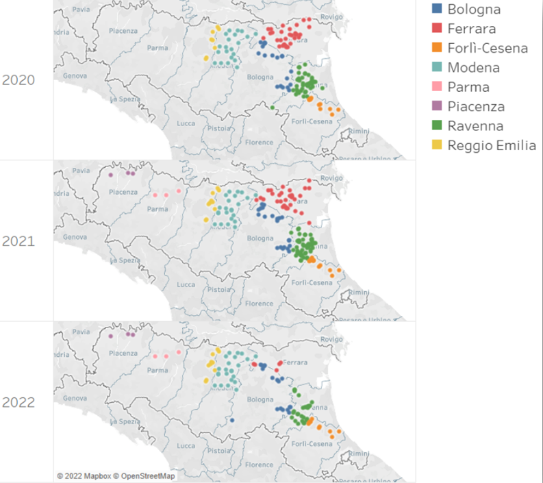

# Un sistema di telemetria per l’ortofrutta

:::: {.columns}

::: {.column width="50%"}

Gli impatti del cambiamento climatico sono talmente rapidi che quello che è successo l’anno passato non è più vero oggi. Abbiamo bisogno di intervenire rapidamente e prendere decisioni basate sulle evidenze e non solo sulla storia

:::
::: {.column width="50%"}

:::
::::

# La piattaforma Agro.Big.Data.Science

:::: {.columns}

::: {.column width="50%"}

Una piattaforma modulare per raccogliere, analizzare e visualizzare dati eterogenei dal campo e nella fase di post raccolta

:::
::: {.column width="50%"}

:::
::::

# La piattaforma Agro.Big.Data.Science

# Cimice.Net

:::: {.columns}

::: {.column width="50%"}

The brown marmorated stink bug (Halyomorpha halys) is an insect pest species causing economic damages to several agricultural commodities

- A data-driven approach to support the application of Integrated Pest Management strategies against H. halys

:::
::: {.column width="50%"}

:::
::::

#

:::: {.columns}

::: {.column width="50%"}

Three years long project

- Goal: help growers in protecting crops
- A network of monitoring traps has been deployed throughout Emilia-Romagna
    - Monitoring 145, 168, and 101 farms in 2020-2022 (and currently in 2023)
- A big data platform has been implemented
    - Real-time pest surveillance
    - Understanding about seasonal invasion dynamics and the main factors contributing to its spread
    - Find relationships between spreading and environmental factors

:::
::: {.column width="50%"}

:::
::::

#

:::: {.columns}

::: {.column width="50%"}

The acquisition of data concerning the installation and monitoring of traps have been aided by CASE (Collaborative Agro SEnsing)

- Dynamic questionnaire application for on-field data crowdsourcing in the agricultural domain
- Facilitate and standardize the communications between on-field operators with first-hand visuals of a given field/orchard and the technicians needing a 360-degrees view of all fields/orchards for real-time monitoring, operational oversight, coordination, and analytical purposes

:::
::: {.column width="50%"}

:::
::::

# Collaborative Agro SEnsing

:::: {.columns}

::: {.column width="50%"}

:::
::: {.column width="50%"}

:::
::::

# 

# 

# 

# 

# 

:::: {.columns}

::: {.column width="50%"}

:::
::: {.column width="50%"}

:::
::::

# [Live!](https://big.csr.unibo.it/cimice/)